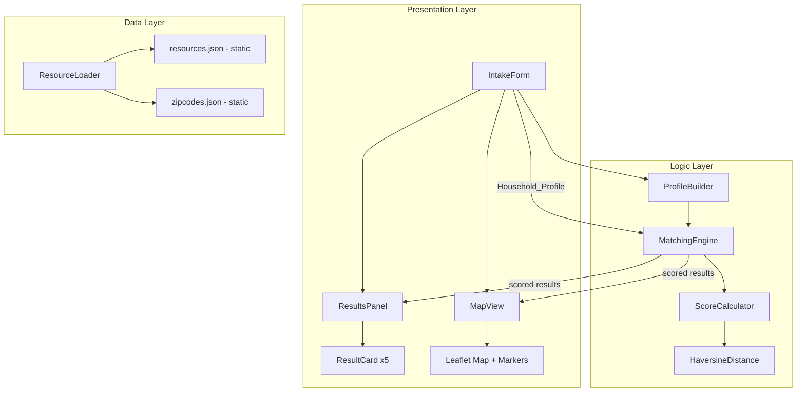
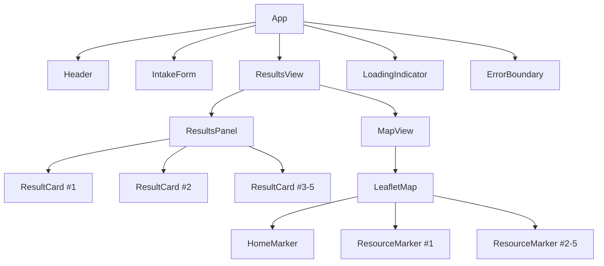
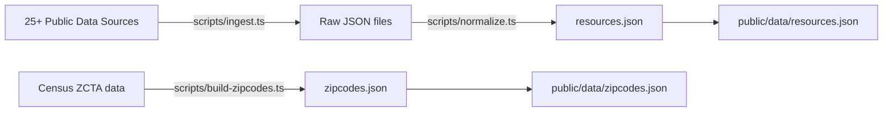

# Design Document: Best Meal Match (NourishNet Food Distribution)

## Overview

Best Meal Match is a static single-page application built with Vite + React + TypeScript that helps households in the Maryland/DC/Virginia region find personalized food assistance resources. The application collects household circumstances through a visual, ESL-friendly intake form, runs a client-side Matching Engine against a pre-processed static JSON dataset of 25+ public food distribution sources, and presents the top 5 results as numbered cards alongside an interactive Leaflet map.

The entire application runs client-side with no backend server. Data from public sources is pre-processed at build time into a static `resources.json` file. Zip code geocoding uses a bundled static lookup table covering MD/DC/VA zip codes, eliminating runtime API dependencies. The app deploys to GitHub Pages as a fully static site.

### Key Design Decisions

| Decision | Choice | Rationale |
|---|---|---|
| Build tool | Vite 5 + React 18 + TypeScript | Fast HMR, tree-shaking, native TS support, OSI-licensed |
| Map library | react-leaflet v4 + Leaflet + OpenStreetMap tiles | Fully open-source, no API key required, lightweight |
| Geocoding | Static zip code → lat/lng JSON lookup table | No runtime API dependency, works offline, GitHub Pages compatible |
| Styling | CSS Modules | Scoped styles, zero runtime cost, no extra dependency |
| Data layer | Pre-processed static JSON | No server needed, GitHub Pages compatible, fast loading |
| Testing (PBT) | fast-check + Vitest | Leading TypeScript PBT library, integrates with Vitest runner |
| Deployment | GitHub Pages with `base` path in vite.config.ts | Free hosting, static-only, matches challenge requirements |

### Research Findings

- **react-leaflet v4** provides React component bindings for Leaflet. The `MapContainer`, `TileLayer`, `Marker`, and `Popup` components cover all map requirements. OpenStreetMap tile layer requires no API key. ([react-leaflet docs](https://react-leaflet.js.org/docs/v4/start-installation/))
- **Geocoding approach**: For a static site targeting MD/DC/VA, a bundled zip code lookup table (~2,500 entries for the tri-state area, ~50KB) is more reliable than external API calls. The table maps each zip code to `{lat, lng, city, state}`. This avoids CORS issues, rate limits, and external dependencies. Data sourced from US Census ZCTA files (public domain).
- **GitHub Pages deployment**: Vite requires setting `base: '/<repo-name>/'` in `vite.config.ts` when deploying to `https://<user>.github.io/<repo>/`. The `gh-pages` npm package automates the deploy step. ([Vite deployment docs](https://vitejs.dev/guide/static-deploy.html))
- **Haversine formula**: Standard great-circle distance calculation between two lat/lng points. Used by the Matching Engine for proximity scoring. Well-established, no external dependency needed — implemented as a pure function.
- **fast-check**: The leading property-based testing library for TypeScript/JavaScript. Provides rich arbitraries for generating test data and integrates with Vitest. ([fast-check on npm](https://www.npmjs.com/package/fast-check))

## Architecture

The application follows a layered architecture with clear separation between data, logic, and presentation.



### Data Flow

1. User fills out `IntakeForm` → `ProfileBuilder` creates a `Household_Profile`
2. `Household_Profile` is passed to `MatchingEngine`
3. `MatchingEngine` loads resources via `ResourceLoader` (cached after first load)
4. `ScoreCalculator` computes `Match_Score` for each resource using `HaversineDistance` for proximity
5. Results are sorted descending by score, ties broken by distance
6. Top 5 results are returned to `ResultsPanel` and `MapView`

## Components and Interfaces

### Component Tree



### Key Interfaces

```typescript
// ProfileBuilder output
interface HouseholdProfile {
  location: {
    zipCode?: string;
    city?: string;
    lat: number;
    lng: number;
  };
  householdSize?: number;
  income?: {
    magi?: number;
    isUnemployed: boolean;
  };
  utilityAccess: 'oven-stove' | 'microwave-only' | 'none';
  dietaryRestrictions?: string[];
  mobilityLimitations?: string[];
}

// Resource from static JSON
interface Resource {
  id: string;
  organizationName: string;
  address: string;
  lat: number;
  lng: number;
  operatingHours: string;
  foodTypes: string[];
  eligibilityRequirements: string[];
  contactInfo: string;
  sourceAttribution: string;
  householdSizeRange?: { min: number; max: number };
  incomeThreshold?: number;
  utilityRequirements?: ('oven-stove' | 'microwave-only' | 'none')[];
  dietaryOptions?: string[];
}

// Matching Engine output
interface ScoredResource {
  resource: Resource;
  matchScore: number;
  distanceMiles: number;
}

// ScoreCalculator weights
interface ScoreWeights {
  proximity: number;      // default 0.35
  eligibility: number;    // default 0.25
  foodSuitability: number; // default 0.20
  dietaryMatch: number;   // default 0.10
  householdFit: number;   // default 0.10
}
```

### MatchingEngine Module

```typescript
// Core matching function — pure, no side effects
function scoreResource(
  profile: HouseholdProfile,
  resource: Resource,
  weights: ScoreWeights
): ScoredResource;

// Top-level orchestrator
function getTopMatches(
  profile: HouseholdProfile,
  resources: Resource[],
  maxResults?: number  // defaults to 5
): ScoredResource[];
```

**Scoring algorithm**:
1. **Proximity score** (0–1): Inverse distance using Haversine. Score = `max(0, 1 - (distance / maxRadius))` where `maxRadius` = 50 miles.
2. **Eligibility score** (0–1): Binary match on income threshold and household size range. Full match = 1.0, partial = 0.5, no data = 0.75 (benefit of the doubt).
3. **Food suitability score** (0–1): Checks if resource's food types are compatible with household's `utilityAccess`. E.g., if household has no cooking utilities, raw ingredients score lower.
4. **Dietary match score** (0–1): Proportion of household dietary restrictions satisfied by resource's dietary options.
5. **Household fit score** (0–1): Whether household size falls within resource's supported range.

Final score = weighted sum of all component scores.

### HaversineDistance

```typescript
// Pure function — no side effects
function haversineDistance(
  lat1: number, lng1: number,
  lat2: number, lng2: number
): number; // returns distance in miles
```

### ProfileBuilder

```typescript
function buildProfile(formData: IntakeFormData): HouseholdProfile;
function serializeProfile(profile: HouseholdProfile): string; // JSON
function deserializeProfile(json: string): HouseholdProfile;
```

### ResourceLoader

```typescript
// Loads and caches static JSON data
async function loadResources(): Promise<Resource[]>;
async function geocodeZipCode(zip: string): Promise<{ lat: number; lng: number } | null>;
async function geocodeCity(city: string): Promise<{ lat: number; lng: number } | null>;
```

### React Components

| Component | Props | Responsibility |
|---|---|---|
| `IntakeForm` | `onSubmit: (profile: HouseholdProfile) => void` | Collects user input, validates, builds profile |
| `ResultsPanel` | `results: ScoredResource[]` | Renders ranked list of ResultCards |
| `ResultCard` | `result: ScoredResource, rank: number` | Displays single resource with rank, name, address, distance, food types, eligibility, hours |
| `MapView` | `results: ScoredResource[], homeLocation: {lat, lng}` | Renders Leaflet map with numbered markers and home marker |
| `LoadingIndicator` | `message?: string` | Spinner with optional message, uses icons over text |
| `ErrorMessage` | `error: string, onRetry: () => void` | User-friendly error with retry button |
| `Header` | none | App title with food/home icon, minimal text |

### ESL-Friendly Visual Design

- Icons from a bundled icon set (e.g., Lucide React — open-source, MIT licensed) for all form labels and result attributes
- Color-coded match quality: green (excellent), yellow (good), orange (fair) on result cards
- Numbered markers (1–5) on map correspond to result card numbers
- Minimal text labels; rely on universally understood icons (🏠 home, 🍎 food, 🕐 hours, 📍 location, ♿ accessibility)
- Large touch targets (minimum 44x44px) for mobile usability

## Data Models

### Static Data Files

#### `resources.json`
Pre-processed at build time from 25+ data sources. Array of `Resource` objects.

```json
[
  {
    "id": "cafb-001",
    "organizationName": "Capital Area Food Bank - Main Distribution",
    "address": "4900 Puerto Rico Ave NE, Washington, DC 20017",
    "lat": 38.9337,
    "lng": -76.9513,
    "operatingHours": "Mon-Fri 9am-3pm",
    "foodTypes": ["canned goods", "fresh produce", "dairy", "prepared meals"],
    "eligibilityRequirements": ["photo ID", "proof of address"],
    "contactInfo": "(202) 644-9800",
    "sourceAttribution": "capitalareafoodbank.org",
    "householdSizeRange": { "min": 1, "max": 10 },
    "incomeThreshold": 50000,
    "utilityRequirements": ["oven-stove", "microwave-only", "none"],
    "dietaryOptions": ["vegetarian", "gluten-free"]
  }
]
```

#### `zipcodes.json`
Static lookup table for MD/DC/VA zip codes.

```json
{
  "20001": { "lat": 38.9120, "lng": -77.0160, "city": "Washington", "state": "DC" },
  "20740": { "lat": 38.9897, "lng": -76.9378, "city": "College Park", "state": "MD" },
  "22030": { "lat": 38.8462, "lng": -77.3064, "city": "Fairfax", "state": "VA" }
}
```

### State Management

Application state is managed with React `useState`/`useReducer` — no external state library needed for this scope.

```typescript
interface AppState {
  phase: 'intake' | 'loading' | 'results' | 'error';
  profile: HouseholdProfile | null;
  results: ScoredResource[];
  error: string | null;
}
```

### Build-Time Data Pipeline



The data ingestion scripts run at build time (or manually before build). They are Node.js scripts in a `scripts/` directory, separate from the React app. The output static JSON files are placed in `public/data/` and served as static assets.


## Correctness Properties

*A property is a characteristic or behavior that should hold true across all valid executions of a system — essentially, a formal statement about what the system should do. Properties serve as the bridge between human-readable specifications and machine-verifiable correctness guarantees.*

### Property 1: Profile construction preserves all form fields

*For any* valid `IntakeFormData` with a non-empty zip code or city and any combination of optional fields (household size, MAGI/unemployed, utility access, dietary restrictions, mobility limitations), calling `buildProfile` SHALL produce a `HouseholdProfile` whose fields match every entered form value — no field is dropped or altered.

**Validates: Requirements 1.5**

### Property 2: HouseholdProfile JSON round-trip

*For any* valid `HouseholdProfile` object, serializing it to JSON via `serializeProfile` and then deserializing via `deserializeProfile` SHALL produce an object deeply equal to the original.

**Validates: Requirements 1.6**

### Property 3: Match score validity and boundedness

*For any* valid `HouseholdProfile` and any valid `Resource`, the `Match_Score` computed by `scoreResource` SHALL be a number in the range [0, 1]. Furthermore, modifying a single scoring factor (e.g., moving the resource closer) while holding all others constant SHALL change the score in the expected direction (closer → higher proximity component).

**Validates: Requirements 2.2**

### Property 4: Top-K matching invariant

*For any* valid `HouseholdProfile` and any array of `Resource` objects, `getTopMatches` SHALL return at most 5 results, sorted in descending order of `Match_Score`, with ties broken by ascending `distanceMiles`. The returned results SHALL be the actual highest-scoring resources from the full input array — no higher-scoring resource exists outside the returned set.

**Validates: Requirements 2.1, 2.3, 2.4, 2.5, 2.7**

### Property 5: ResultCard renders all required fields

*For any* valid `ScoredResource` and rank number, rendering a `ResultCard` SHALL produce output containing the rank position, organization name, address, distance, food types, eligibility summary, and operating hours from the input data.

**Validates: Requirements 2.6**

### Property 6: Resource round-trip parsing

*For any* valid `Resource` object, serializing it to the normalized JSON format and re-parsing it SHALL produce an object deeply equal to the original.

**Validates: Requirements 3.2, 3.6**

### Property 7: Duplicate merging preserves completeness

*For any* set of `Resource` objects containing duplicates (same organization name and address), the deduplication function SHALL produce a merged `Resource` that retains the most complete information — every non-empty field present in any duplicate SHALL appear in the merged result, and the output set SHALL contain no duplicates.

**Validates: Requirements 3.4**

## Error Handling

### Error Categories and Responses

| Error | Component | User-Facing Response | Technical Handling |
|---|---|---|---|
| Empty/invalid zip code | IntakeForm | Inline validation error with icon | Prevent form submission, focus error field |
| Zip code not in lookup table | ResourceLoader | "We don't have data for this area yet. Try a nearby zip code." | Return null from geocodeZipCode, show message |
| resources.json fails to load | ResourceLoader | "Unable to load food resource data. Please try again." + retry button | Catch fetch error, set AppState to 'error' |
| Zero matching results | MatchingEngine | "No exact matches found. Try adjusting your filters or expanding your search area." | Return empty array, ResultsPanel shows suggestion |
| Map tiles fail to load | MapView | Loading placeholder remains with "Map unavailable" text | Leaflet handles tile errors; show fallback UI |
| Unexpected runtime error | ErrorBoundary | "Something went wrong. Please refresh the page." + retry button | React Error Boundary catches, logs to console |

### Validation Rules

- **Zip code**: Must be 5 digits, must exist in `zipcodes.json`
- **City**: Must be non-empty string after trimming, matched case-insensitively against cities in `zipcodes.json`
- **Household size**: Must be positive integer (1–20), optional
- **MAGI**: Must be non-negative number, disabled when unemployed checkbox is checked
- **Utility access**: Must be one of the three enum values, defaults to 'oven-stove'

### Graceful Degradation

- If `zipcodes.json` fails to load, the app shows an error state with retry
- If `resources.json` loads but is empty, the app shows the zero-results message
- The map component is wrapped in a Suspense boundary with a loading fallback
- All async operations use AbortController for cleanup on unmount

## Testing Strategy

### Dual Testing Approach

The project uses both unit tests and property-based tests for comprehensive coverage.

**Test Runner**: Vitest (fast, Vite-native, TypeScript support)
**PBT Library**: fast-check (leading TypeScript PBT framework)

### Property-Based Tests

Each correctness property from the design document is implemented as a single property-based test using fast-check. Each test runs a minimum of 100 iterations.

| Property | Test File | Tag |
|---|---|---|
| Property 1: Profile construction | `src/__tests__/profileBuilder.property.test.ts` | Feature: nourishnet-food-distribution, Property 1: Profile construction preserves all form fields |
| Property 2: HouseholdProfile round-trip | `src/__tests__/profileBuilder.property.test.ts` | Feature: nourishnet-food-distribution, Property 2: HouseholdProfile JSON round-trip |
| Property 3: Score validity | `src/__tests__/matchingEngine.property.test.ts` | Feature: nourishnet-food-distribution, Property 3: Match score validity and boundedness |
| Property 4: Top-K matching | `src/__tests__/matchingEngine.property.test.ts` | Feature: nourishnet-food-distribution, Property 4: Top-K matching invariant |
| Property 5: ResultCard completeness | `src/__tests__/resultCard.property.test.ts` | Feature: nourishnet-food-distribution, Property 5: ResultCard renders all required fields |
| Property 6: Resource round-trip | `src/__tests__/resourceLoader.property.test.ts` | Feature: nourishnet-food-distribution, Property 6: Resource round-trip parsing |
| Property 7: Duplicate merging | `src/__tests__/resourceLoader.property.test.ts` | Feature: nourishnet-food-distribution, Property 7: Duplicate merging preserves completeness |

### Unit Tests (Example-Based)

| Area | Test File | Coverage |
|---|---|---|
| IntakeForm validation | `src/__tests__/intakeForm.test.tsx` | Req 1.1–1.4: required field validation, unemployed checkbox behavior, optional fields rendering |
| Haversine distance | `src/__tests__/haversine.test.ts` | Known distance pairs (e.g., DC to Baltimore ≈ 35 miles) |
| Map markers | `src/__tests__/mapView.test.tsx` | Req 4.1–4.5: numbered markers, home marker, popup content |
| Accessibility | `src/__tests__/accessibility.test.tsx` | Req 5.2–5.3: keyboard navigation, ARIA labels |
| Error states | `src/__tests__/errorHandling.test.tsx` | Req 6.1–6.5: loading indicator, error message, zero results |
| Zero results | `src/__tests__/matchingEngine.test.ts` | Req 6.5: empty dataset handling |

### Integration / Smoke Tests

| Area | Test | Coverage |
|---|---|---|
| Build verification | `npm run build` exits 0 | Req 7.4 |
| License audit | `license-checker --onlyAllow` | Req 7.1 |
| Accessibility audit | axe-core integration in Vitest | Req 5.4 |

### Test Configuration

```typescript
// vitest.config.ts
export default defineConfig({
  test: {
    environment: 'jsdom',
    globals: true,
    setupFiles: ['./src/__tests__/setup.ts'],
  },
});
```

### fast-check Configuration

Each property test uses `fc.assert` with `{ numRuns: 100 }` minimum. Generators are defined for:
- `HouseholdProfile` — random valid profiles with all field combinations
- `Resource` — random valid resources with realistic coordinate ranges for MD/DC/VA
- `IntakeFormData` — random valid form inputs
- `ScoredResource` — random scored results with valid score ranges

